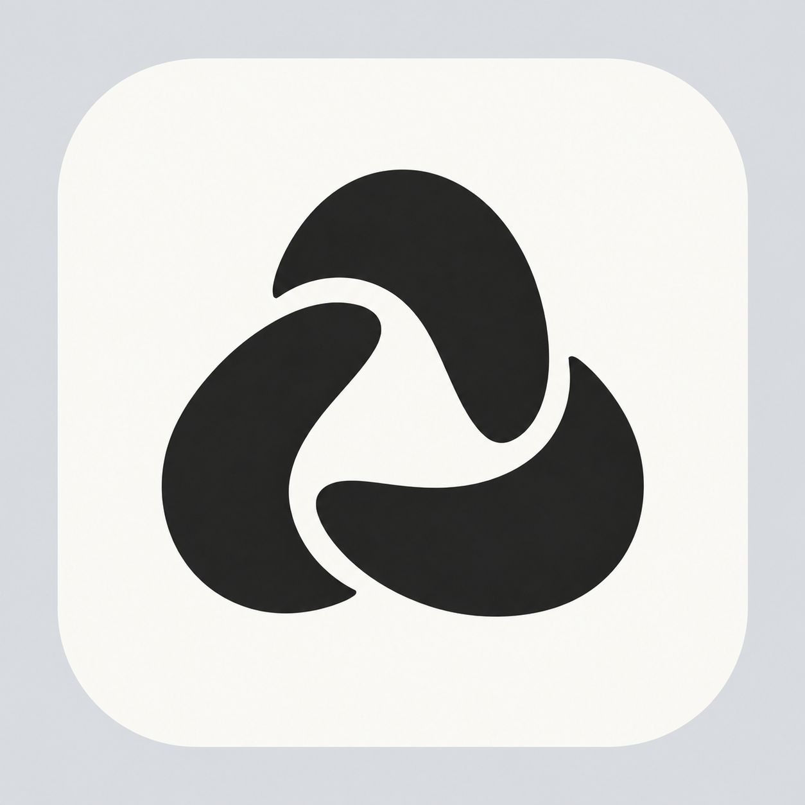

# Refined MacEase loop — v2

Approved for MacEase's app and menu bar icons. This refines [the first loop concept](MacEase-Loop.png). The preview uses a light-grey presentation backdrop; the production SVG preserves the mark's contour and spacing with transparent outer margins.

The refinement keeps the three-part identity and adjusts the curve transitions, terminal shapes, spacing and optical balance.

Created with the built-in image generation tool.

## Refinement prompt

Use case: precise-object-edit / logo-brand refinement. Edit the supplied MacEase icon as the design target. The user likes this new abstract direction and asks to make it more beautiful. Refine this SAME three-part flowing loop; do not replace it with a different symbol.
Preserve: three interlocking curved lobes, the rounded triangular overall identity, one open central negative space, charcoal mark on a warm off-white rounded-square macOS tile, actual transparent outer canvas, static flat graphic style, no text.
Refinements: redraw the curves with exceptionally clean, intentional geometric control. Balance the visual weight of all three lobes; the top lobe is currently too heavy and the lower two feel like separate blobs. Make all three parts feel like one elegant, continuous, gently rotating shape, with smoothly accelerating curves and consistent thickness. Give the central opening a calm, clearly defined rounded triangular shape. Make the three separating channels slightly wider and more consistent, smoothly flowing rather than pinched. Smooth the abrupt chopped tips into short, softly finished terminals; preserve their separation. Reduce the symbol by about 8 percent so it breathes more within the tile, and optically center it. The result should feel lighter, tighter, more balanced and more intentional, while remaining bold enough for a 32-pixel Dock icon.
Finish: flat, pristine solid charcoal #242424 and soft neutral ivory #F8F7F3; remove the mottled texture, uneven grey tones, stray edge pixels and rough translucent border of the current image. Perfectly smooth anti-aliased contours and a clean continuous-corner tile silhouette. No gradients, shadows, reflections, bevels, embossing, 3D rendering, decorative details, letterforms, extra rings or added shapes. Do not turn it into a recycling sign, fan, yin-yang, triquetra or any existing technology logo. Keep this mark's identity, simply make it more refined. One finished icon only, square composition, no labels or side-by-side comparison.

## Presentation background prompt

Edit only the grey checkerboard outside the rounded-square icon in this input image. Replace that checkerboard with a perfectly uniform SOLID light grey background (#DDE0E4), fully opaque. This is a static design presentation, not a transparent export. Do NOT output transparency or an alpha cutout. Keep the entire rounded ivory tile and the three-lobed charcoal symbol exactly as they are in the input, with their clean curves and existing positions. Do not change the design, add texture, shadow or any decorative element. The only change is checkerboard to flat solid light grey outside the tile. Crisp smooth tile border. No text.
